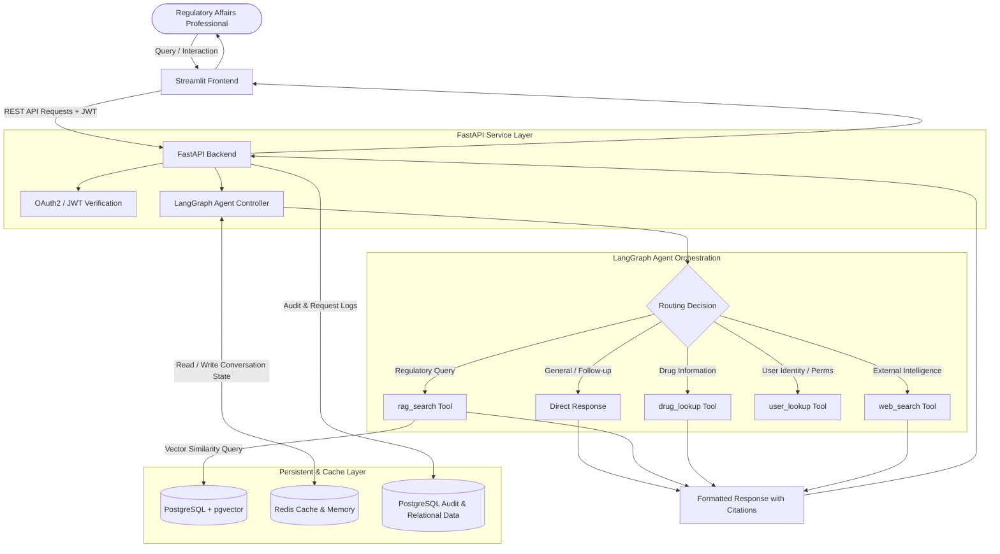
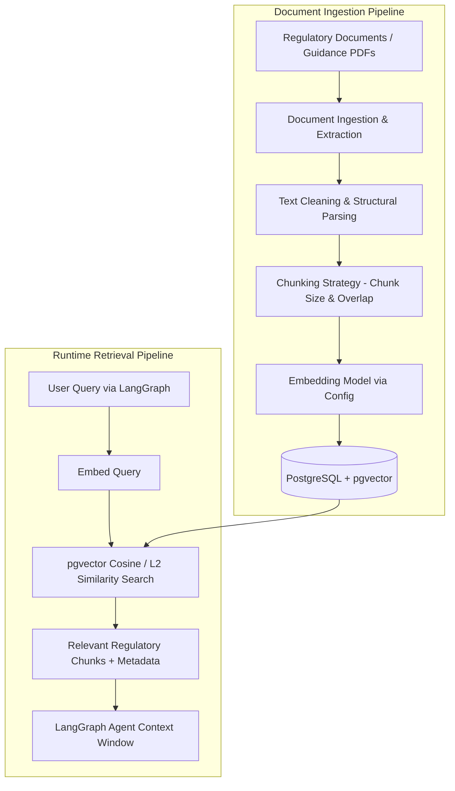

# Regulatory Affairs Assistant — System Architecture

## 1. Project Title
**Regulatory Affairs Assistant** (Agentic RAG-Based Regulatory Information Assistant)

---

## 2. Project Purpose
The Regulatory Affairs Assistant is an intelligent, agent-driven information retrieval and synthesis platform tailored for regulatory affairs professionals in life sciences, pharmaceuticals, and healthcare. Its primary objective is to streamline the discovery, interpretation, and verification of complex regulatory guidelines, drug filings, compliance requirements, and agency documentation.

---

## 3. Scope and Boundaries
* **Scope:**
  * Retrieval and analysis of internal regulatory guidance documents via RAG.
  * Integration with drug reference data and external regulatory web resources.
  * Session-based conversation memory management.
  * Role-based access and authentication via JWT.
  * Comprehensive audit logging for all interactions and queries.
* **Boundaries:**
  * **Information Retrieval Only:** The system is strictly an advisory and information assistance platform.
  * **No Autonomous Regulatory Decisions:** The system does NOT make regulatory approvals, submissions, or compliance sign-offs. All generated information must be reviewed and validated by qualified regulatory specialists.
  * **No MCP:** Model Context Protocol (MCP) is explicitly excluded from this system.

---

## 4. Technology Stack

| Layer | Technology | Purpose |
| :--- | :--- | :--- |
| **Frontend** | Streamlit | Interactive web user interface for queries and document interaction |
| **Backend API** | FastAPI (Python 3.12) | High-performance RESTful API, authentication, and routing |
| **Agent Orchestrator** | LangGraph | State graph workflow, dynamic tool routing, and reasoning loops |
| **LLM & Embeddings** | Configurable via Environment (`.env`) | Dynamic model selection (e.g., OpenAI, Azure OpenAI, custom endpoints) |
| **Database** | PostgreSQL 16 | Relational storage for users, metadata, and audit logs |
| **Vector Storage** | pgvector extension | Vector indexing and semantic similarity search in PostgreSQL |
| **Conversation Memory** | Redis 8.x | High-speed cache for chat sessions, conversation buffer, and state |
| **Authentication** | FastAPI OAuth2 / JWT | Secure token-based authentication and endpoint authorization |
| **Configuration** | Pydantic Settings | Type-safe settings and environment variable validation |
| **Deployment** | Docker Compose (Planned) | Multi-container orchestration (FastAPI, Streamlit, Postgres, Redis) |

---

## 5. High-Level Architecture

The architecture separates the presentation layer (Streamlit), application layer (FastAPI & LangGraph), and data/caching layer (PostgreSQL + pgvector & Redis).

---

## 6. Component Responsibilities

1. **Streamlit UI:** Provides an intuitive chat and lookup interface, handles user login forms, manages UI session tokens, and renders responses with source citations.
2. **FastAPI Backend:** Serves as the gateway for all HTTP traffic, issues and validates JWT tokens, handles incoming chat requests, and delegates task execution to the LangGraph agent.
3. **LangGraph Agent:** Coordinates multi-step reasoning, checks conversation context, decides whether to invoke specialized tools, and synthesizes tool outputs into grounded responses.
4. **Tool Suite:** Isolated, deterministic Python functions called by the agent to fetch verified facts from documents, drug registries, web searches, or user databases.
5. **PostgreSQL & pgvector:** Serves as the single persistent source of truth for both relational application data and document vector embeddings.
6. **Redis:** Manages fast in-memory session histories and conversational context across chat turns.

---

## 7. User Request Flow

1. **User Authentication:** The user logs in via Streamlit; Streamlit requests a JWT token from FastAPI (`/api/v1/auth/token`) and stores it in the user session.
2. **Query Submission:** The user submits a regulatory query via the Streamlit interface.
3. **API Dispatch:** Streamlit sends a POST request with the query and JWT bearer token to the FastAPI query endpoint.
4. **Security & Context Loading:** FastAPI validates the token, extracts the user ID, and passes the query to the LangGraph runtime. The runtime retrieves prior session messages from Redis.
5. **Agent Evaluation & Tool Execution:** LangGraph evaluates the state:
   * Queries requiring internal regulatory documents trigger `rag_search(query)`.
   * Queries regarding pharmaceutical active ingredients or regulatory product data trigger `drug_lookup(drug_name)` for factual retrieval only (strictly no medical advice or treatment recommendations).
   * Current news, recent agency announcements, or external regulations trigger `web_search(query)`.
   * User metadata inquiries trigger `user_lookup(user_id)`.
   * Straightforward conversational replies are handled directly.
6. **Response Synthesis:** LangGraph synthesizes the retrieved evidence into a coherent response with clear source references.
7. **Audit & Logging:** FastAPI writes the interaction, token usage, tool calls, and final response to PostgreSQL audit logs.
8. **Presentation:** The response is returned to Streamlit and displayed to the user.

---

## 8. RAG Ingestion and Retrieval Flow

The RAG subsystem processes regulatory documents into indexed vector representations, allowing semantic search during agent execution.

### Detailed Pipeline Steps:
1. **Document Ingestion (Initial Document Scope):** Regulatory files are loaded from `data/documents/`. The initial implementation will support:
   * PDF
   * DOCX
   * TXT
   *(Do not add additional document formats at this stage).*
2. **Parsing & Cleaning:** Document structures, sections, headers, and regulatory reference numbers are parsed.
3. **Chunking:** Text is split using chunk sizes calibrated for regulatory paragraphs (maintaining context and citation boundaries).
4. **Embedding Generation:** Chunks are converted to dense vector embeddings using the configured embedding model.
5. **pgvector Storage:** Embeddings, raw chunk text, document identifiers, and section metadata are stored in PostgreSQL.
6. **Retrieval:** When `rag_search` is called, the query is embedded and compared against the vector table using cosine distance (`<=>`), returning top matching chunks.

---

## 9. LangGraph Agent Responsibilities
* **State Management:** Maintains an explicit state dictionary containing message history, current user input, intermediate tool outputs, and execution metadata.
* **Routing Logic:** Evaluates incoming user intent and conditionally routes execution to the appropriate tool node or direct answer node.
* **Grounded Synthesis:** Ensures that all synthesized answers are grounded in the retrieved tool evidence without hallucinations.
* **Guardrails & Boundaries:** Prevents the agent from executing unsupported operations or outputting definitive regulatory approvals.

---

## 10. Direct Tools and Their Responsibilities

1. **`rag_search(query: str) -> str`**
   * Searches the internal regulatory vector index in PostgreSQL (`pgvector`).
   * Returns top matching document sections, guidelines, and document identifiers.
2. **`drug_lookup(drug_name: str) -> dict`**
   * An information-retrieval tool that queries structured drug registries and database tables to retrieve structured drug/product information from an external or structured source (e.g., active ingredients, indications, approval status).
   * **Scope & Medical Disclaimer:** It is strictly an information-retrieval tool. It must NOT provide medical advice, prescribe treatment, or independently recommend dosage or treatment decisions.
3. **`web_search(query: str) -> str`**
   * Performs real-time external searches against official regulatory agency portals (e.g., FDA, EMA, ICH) for updated announcements or public guidelines.
4. **`user_lookup(user_id: str) -> dict`**
   * Retrieves user access permissions, department metadata, and audit information from the PostgreSQL user registry.

---

## 11. PostgreSQL Responsibilities
* **Relational Data Management:** Stores user accounts, hashed credentials, roles, and administrative configuration.
* **Document Metadata:** Stores ingested document records, file paths, upload timestamps, and processing statuses.
* **Audit & Chat Logs:** Records immutable logs of every request, query classification, tool invocation, and generated output for compliance auditability.

---

## 12. pgvector Responsibilities
* **Vector Extension:** Provides vector data types (`vector(N)`) directly inside PostgreSQL tables.
* **Vector Indexing:** Enables rapid approximate nearest neighbor (ANN) search using HNSW or IVFFlat indexes.
* **Unified Querying:** Enables combined vector similarity search with standard relational SQL filters (e.g., filter by regulatory body, document date, or category).

---

## 13. Redis Responsibilities
* **Conversation Buffer:** Stores active conversation threads and chat history keyed by session/conversation ID.
* **Fast State Retrieval:** Delivers low-latency read and write operations for multi-turn dialogues.
* **TTL Expiration:** Automatically cleans up expired or inactive chat sessions based on configurable retention limits.

---

## 14. FastAPI Responsibilities
* **API Endpoints:** Exposes structured, documented REST endpoints (`/docs`, `/api/v1/chat`, `/api/v1/auth`, etc.).
* **Security & JWT Handling:** Enforces authentication, verifies token signatures, and injects validated user context into request handlers.
* **Pydantic Validation:** Validates all incoming request payloads and outgoing response schemas.
* **Error Handling:** Standardizes HTTP error responses and exception logging.

---

## 15. Streamlit Responsibilities
* **User Presentation:** Delivers a modern, clean web interface tailored for regulatory professionals.
* **Session Management:** Persists JWT tokens, selected models, and conversation IDs in Streamlit session state.
* **Citation Display:** Renders retrieved source documents, page numbers, and regulatory reference tags alongside agent answers.
* **Interactive Controls:** Provides filters for regulatory agency sources, document upload triggers, and chat clearing.

---

## 16. Authentication Flow
1. **Credentials Dispatch:** User submits username and password via the Streamlit login interface.
2. **Verification:** FastAPI receives credentials at `/api/v1/auth/token`, looks up the user record in PostgreSQL, and verifies the password hash using `bcrypt`.
3. **Token Issuance:** Upon success, FastAPI issues HS256-signed JWT access tokens with an expiration time (`JWT_ACCESS_TOKEN_EXPIRE_MINUTES`), matching the project configuration (`JWT_ALGORITHM=HS256`).
4. **Client Storage:** Streamlit stores the JWT in its session state for subsequent API requests.
5. **Authenticated Requests:** Streamlit attaches the token as an HTTP header: `Authorization: Bearer <token>`.
6. **Dependency Injection:** FastAPI dependencies validate the token on protected routes and extract user identity.

---

## 17. Logging Flow
1. **Request Interception:** FastAPI captures incoming user queries along with user identity and session ID.
2. **Execution Tracking:** Tool calls, execution durations, and model metadata from LangGraph are accumulated.
3. **Database Logging:** The entire transaction is recorded in PostgreSQL `audit_logs` (storing timestamp, user_id, prompt, tool_calls, response, and token count).
4. **Compliance Trail:** Provides a tamper-resistant audit trail necessary for regulatory and quality assurance inspection.

---

## 18. Security and Configuration Approach
* **Pydantic Settings:** All configuration values are managed in a centralized, type-safe settings class loaded from `.env`.
* **Zero Secrets in Repository:** The `.env` file is excluded via `.gitignore`; only `.env.example` with dummy placeholders is tracked.
* **Role-Based Authorization:** Endpoints verify user roles before granting access to sensitive documents or administration tools.
* **Credential Protection:** Passwords are never stored in plaintext and are hashed using industry-standard algorithms (`bcrypt`).

---

## 19. Future Docker Compose Deployment Architecture
In subsequent phases, the application stack will be containerized and orchestrated via Docker Compose:

* **`frontend` service:** Container running the Streamlit web application.
* **`backend` service:** Container running FastAPI with Uvicorn.
* **`db` service:** PostgreSQL 16 container with `pgvector` pre-installed and initialized.
* **`redis` service:** Redis container providing memory caching.
* **Shared Network & Volumes:** A private Docker bridge network connecting services, with persistent Docker volumes for PostgreSQL data and Redis data.

---

## 20. Explicit Statement: MCP (Model Context Protocol) is NOT Used
* **Model Context Protocol (MCP) is NOT part of this project.**
* The architecture deliberately does not implement, depend on, or connect to MCP servers, clients, or SDKs. All tool execution and integration are handled natively through Python functions orchestrated by LangGraph.

---

## 21. Explicit Statement: No Autonomous Regulatory Decision-Making
* **The Regulatory Affairs Assistant does NOT make autonomous regulatory decisions, approvals, or legal determinations.**
* The platform functions strictly as an information retrieval, document analysis, and synthesis assistant. All recommendations, summaries, and regulatory citations must be independently reviewed and approved by certified human regulatory affairs specialists before any official submission or operational implementation.
